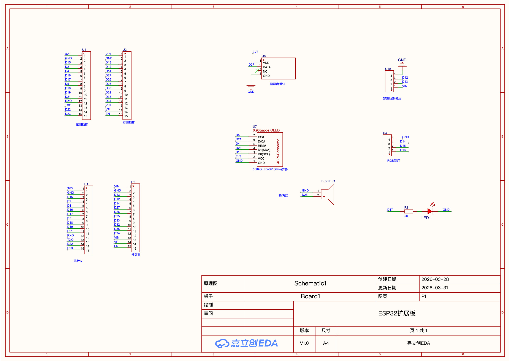
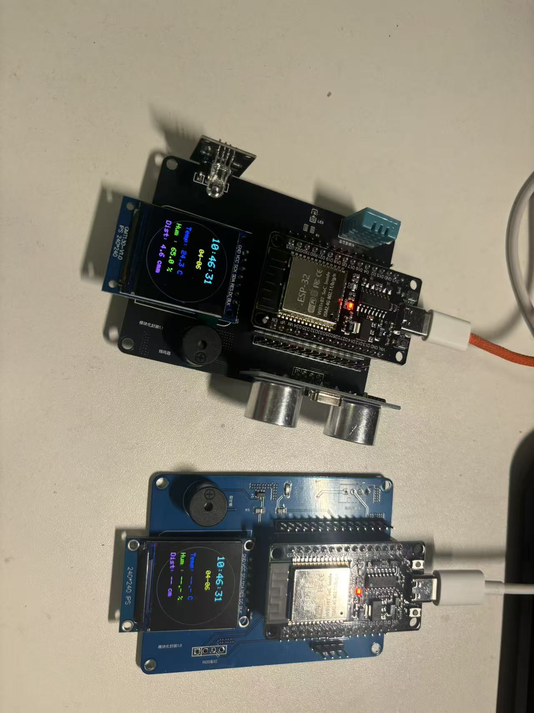
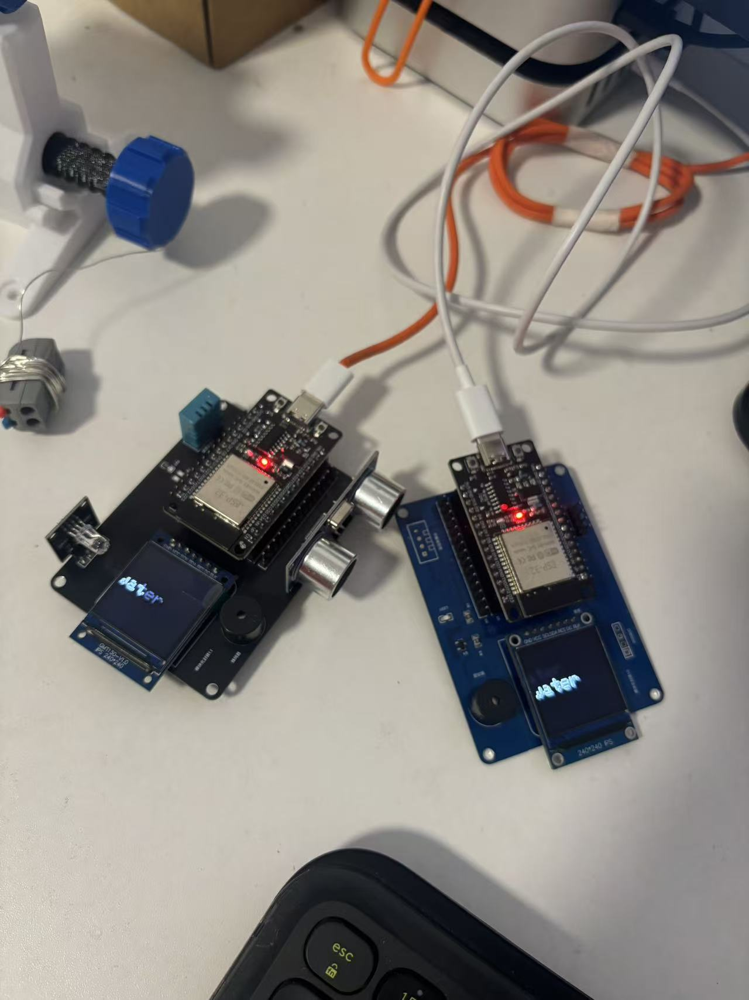
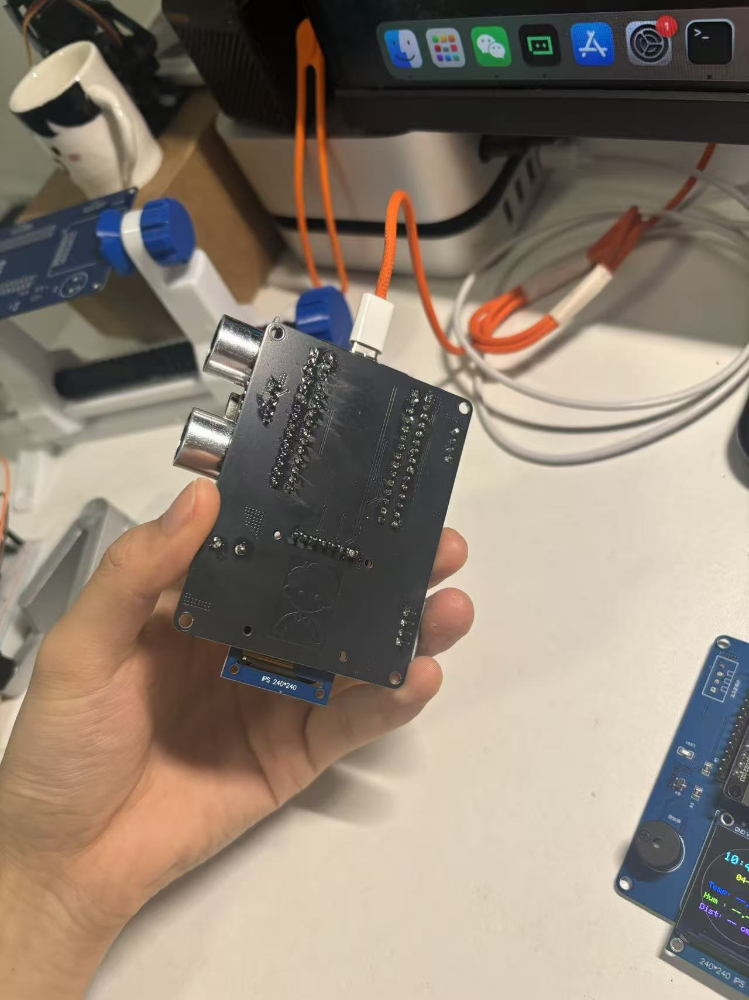

# 🚀 ESP32 智能控制系统

> 一套完整的物联网智能控制解决方案，集硬件设计、后端服务、移动应用于一体。


---

## 📋 项目概述

**ESP32智能控制系统**是一个完整的物联网解决方案，集成了硬件电子设计、Go后端服务、Flutter移动应用，支持远程设备控制、实时数据监控、智能家居集成等功能。

### 🎯 核心功能

#### 🔌 硬件层面
- ESP32微控制器（双核240MHz处理器）
- Wi-Fi & 蓝牙双无线连接
- 🎨 RGB LED全彩小灯（16百万色）
- 🔊 蜂鸣器（音频反馈）
- 📡 HC-SR04超声波模块（距离测量）
- 🖥️ 240×240 IPS彩色屏幕（实时显示）
- 🌡️ DHT11温湿度传感器
- 多路GPIO输入输出
- ADC/DAC模拟处理
- 低功耗设计

#### 🖥️ 后端服务 (Go)
- RESTful API接口
- WebSocket实时通信
- 用户认证和授权
- 设备管理和控制
- 数据存储和分析

#### 📱 移动应用 (Flutter)
- 跨平台支持（iOS/Android）
- 实时数据展示
- 直观的设备控制界面
- 多设备管理
- 用户认证系统

---

## 🏗️ 系统架构

```
┌─────────────────────────────────────────────────────┐
│                   Mobile Application                 │
│              (Flutter - iOS/Android)                │
│          📱 用户界面、设备控制、数据展示            │
└────────────────────┬────────────────────────────────┘
                     │ HTTP/WebSocket
                     │
┌────────────────────▼────────────────────────────────┐
│               Backend Services (Go)                  │
│      API服务、数据处理、设备管理、用户认证         │
└────────────────────┬────────────────────────────────┘
                     │ WiFi/Bluetooth
                     │
┌────────────────────▼────────────────────────────────┐
│                 ESP32 Device                        │
│      硬件控制、传感器采集、通信处理                 │
└─────────────────────────────────────────────────────┘
```

---

## 📦 项目结构

```
ESP32_intelligent_control/
├── 硬件设计相关文件
│   ├── code/
│   │   └── v1.1.c                      # ESP32固件代码 (v1.1版本)
│   ├── Image/
│   │   ├── schematic_diagram.png        # 原理图
│   │   ├── PCB_PCB1_2026-04-06.pdf     # PCB设计
│   │   ├── BOM_Board1_Schematic1_*.xlsx # 物料清单
│   │   ├── physical_object1-4.jpg       # 实物照片
│   └── 说明书.md                         # 硬件详细说明书
│
├── 📱 前端应用（Flutter）
│   └── https://github.com/duasong111/ESP32_view.git
│       ├── lib/                         # Flutter代码
│       ├── assets/                      # 资源文件
│       ├── android/                     # Android配置
│       ├── ios/                         # iOS配置
│       └── pubspec.yaml                 # 依赖管理
│
├── 🖥️ 后端服务（Go）
│   └── https://github.com/duasong111/go.git
│       ├── api/                         # API接口
│       ├── models/                      # 数据模型
│       ├── handlers/                    # 请求处理器
│       ├── config/                      # 配置文件
│       └── main.go                      # 程序入口
│
└── README.md                             # 本文件
```

---

## 🛠️ 完整使用指南

### 第一步：硬件准备

#### 1.1 物料采购
查看物料清单文件：[Image/BOM_Board1_Schematic1_2026-04-06.xlsx](Image/BOM_Board1_Schematic1_2026-04-06.xlsx)

主要核心器件：
- ESP32微控制器 ×1
- AMS1117-3.3稳压芯片 ×1
- 240×240 IPS彩色屏幕 ×1
- RGB LED（全彩小灯）×1
- 蜂鸣器 ×1
- HC-SR04超声波模块 ×1
- DHT11温湿度传感器 ×1
- 电源管理和外围电路

#### 1.2 电路组装
按照PCB原理图焊接即可，关键引脚连接：
- [原理图：schematic_diagram.png](Image/schematic_diagram.png)
- [PCB设计：PCB_PCB1_2026-04-06.pdf](Image/PCB_PCB1_2026-04-06.pdf)

**关键引脚配置：**
| 设备 | GPIO引脚 | 功能说明 |
|------|---------|--------|
| DHT11温湿度 | GPIO27 | 数据引脚 |
| 超声波TRIG | GPIO13 | 触发信号 |
| 超声波ECHO | GPIO12 | 回复信号 |
| RGB红 | GPIO14 | 红色通道 |
| RGB绿 | GPIO15 | 绿色通道 |
| RGB蓝 | GPIO16 | 蓝色通道 |
| 蜂鸣器 | GPIO25 | 音频输出 |
| TFT屏幕 | SPI | 使用TFT_eSPI库 |

#### 1.3 烧写固件
使用固件文件：[code/v1.1.c](code/v1.1.c)

详见下方"ESP32固件烧写"章节

#### 1.4 硬件调试
确保以下功能正常工作：
- 电源指示灯正常亮起 ✓
- 屏幕显示正常（240×240分辨率）✓
- RGB灯可调整颜色亮度 ✓
- 蜂鸣器能发声 ✓
- 超声波模块能测距 ✓

---

### 第二步：部署后端服务

#### 2.1 环境要求
```bash
Go 1.18+
PostgreSQL (可选，取决于后端实现)
Redis (可选，用于缓存和会话)
```

#### 2.2 克隆后端仓库
```bash
git clone https://github.com/duasong111/go.git
cd go
```

#### 2.3 安装依赖
```bash
go mod download
go mod tidy
```

#### 2.4 配置环境变量
在项目根目录创建 `.env` 文件：
```env
# 服务器配置
SERVER_HOST=0.0.0.0
SERVER_PORT=8000

# 数据库配置
DB_HOST=localhost
DB_PORT=5432
DB_USER=postgres
DB_PASSWORD=your_password
DB_NAME=esp32_db

# JWT密钥
JWT_SECRET=your_jwt_secret_key

# CORS配置
CORS_ALLOWED_ORIGINS=http://localhost:3000,http://192.168.18.155:8000
```

#### 2.5 构建和运行
```bash
# 构建可执行文件
go build -o esp32-backend ./main.go

# 运行服务
./esp32-backend

# 或直接运行
go run main.go
```

#### 2.6 验证后端服务
```bash
# 测试API健康检查
curl http://localhost:8000/api/health

# 预期响应
# {"status":"ok","timestamp":"2026-04-06T12:00:00Z"}
```

---

### 第三步：安装移动应用

#### 3.1 环境要求
```
Flutter SDK: 3.5.0+
Dart SDK: 3.5.0+
Android Studio 或 Xcode
Android 5.0+ / iOS 11.0+
```

#### 3.2 克隆前端仓库
```bash
git clone https://github.com/duasong111/ESP32_view.git
cd ESP32_view
```

#### 3.3 安装Flutter依赖
```bash
flutter pub get
```

#### 3.4 配置API端点
编辑 `lib/app/api/endpoints.dart` 文件：

```dart
class Endpoints {
  // 根据你的网络环境修改IP地址
  static const String _devRealDevice = 'http://192.168.18.155:8000';
  
  // API端点
  static const String baseUrl = _devRealDevice;
  static const String loginEndpoint = '$baseUrl/api/auth/login';
  static const String rgbControlEndpoint = '$baseUrl/api/device/rgb';
  static const String webSocketUrl = 'ws://192.168.18.155:8000/esp32/data';
}
```

**重要**: 将 `192.168.18.155` 替换为你实际的后端服务器IP地址。

#### 3.5 运行应用

**在模拟器上运行：**
```bash
flutter run
```

**在Android设备上运行：**
```bash
# 查看连接的设备
flutter devices

# 运行应用
flutter run -d <device_id>
```

**在iOS设备上运行（仅macOS）：**
```bash
flutter run -d <device_id>
```

---

### 第四步：ESP32固件烧写

#### 4.1 准备工作
- 安装USB驱动：CH340或CP2102驱动程序
- Arduino IDE 或 PlatformIO 开发工具
- 数据线连接ESP32到电脑

#### 4.2 使用Arduino IDE烧写

**安装ESP32支持和依赖库：**
1. 打开Arduino IDE → 文件 → 偏好设置
2. 附加开发板管理器网址添加：
   ```
   https://raw.githubusercontent.com/espressif/arduino-esp32/gh-pages/package_esp32_index.json
   ```
3. 工具 → 开发板 → 开发板管理器 → 搜索"ESP32" → 安装

**安装必要的库（Sketch → Include Library → Manage Libraries）：**
- `TFT_eSPI` - IPS屏幕驱动库
- `DHT` - DHT11温湿度传感器库
- `PubSubClient` - MQTT客户端库
- `ArduinoJson` - JSON处理库
- `HTTPClient` - HTTP客户端库

**烧写步骤：**
1. 打开本项目固件文件：`code/v1.1.c`
2. 修改WiFi配置（第13-14行）：
   ```cpp
   const char *ssid     = "your_wifi_name";      // 改成你的WiFi名
   const char *password = "your_wifi_password";  // 改成你的WiFi密码
   ```
3. 选择开发板：工具 → 开发板 → ESP32 Dev Module
4. 选择串口：工具 → 端口 → /dev/ttyUSB0（或对应端口）
5. 设置波特率：115200
6. 点击上传按钮或按Ctrl+U烧写

**完整烧写示例代码流程：**
```cpp
// v1.1.c 固件主要功能流程
#include <TFT_eSPI.h>      // IPS屏幕
#include <DHT.h>            // 温湿度传感器
#include <WiFi.h>           // WiFi连接
#include <PubSubClient.h>  // MQTT
#include <ArduinoJson.h>   // JSON处理

// 初始化各模块
TFT_eSPI tft = TFT_eSPI();     // 240×240屏幕
DHT dht(27, DHT11);             // DHT11：GPIO27

void setup() {
  Serial.begin(115200);
  
  // 初始化屏幕
  tft.init();
  tft.setRotation(0);
  tft.fillScreen(TFT_BLACK);
  
  // 初始化传感器
  dht.begin();
  
  // 连接WiFi
  WiFi.begin(ssid, password);
  while (WiFi.status() != WL_CONNECTED) {
    delay(500);
    Serial.print(".");
  }
  Serial.println("\nWi-Fi connected!");
  Serial.println(WiFi.localIP());
  
  // MQTT连接
  client.setServer(mqtt_server, mqtt_port);
}

void loop() {
  // 读取温湿度
  float temp = dht.readTemperature();
  float humidity = dht.readHumidity();
  
  // 测量距离（超声波）
  float distance = measureDistance();
  
  // 屏幕显示
  tft.setTextColor(TFT_WHITE);
  tft.drawString("Temp: " + String(temp) + "C", 10, 10);
  
  // MQTT发布数据
  publishSensorData(temp, humidity, distance);
  
  delay(1000);
}
```

#### 4.3 使用PlatformIO烧写（推荐）

**platformio.ini配置：**
```ini
[env:esp32]
platform = espressif32
board = esp32doit-devkit-v1
framework = arduino
monitor_speed = 115200
upload_speed = 460800

; 依赖库
lib_deps = 
    TFT_eSPI
    DHT sensor library
    PubSubClient
    ArduinoJson
```

**构建和烧写：**
```bash
# 复制固件文件到src目录
cp code/v1.1.c src/main.cpp

# 修改WiFi配置
# 编辑 src/main.cpp 第13-14行的WiFi信息

# 编译和上传
pio run --target upload --environment esp32

# 查看串口输出
pio device monitor --baud 115200
```

---

## 📋 固件功能说明

本项目使用 **v1.1.c** 固件，主要功能包括：

### 固件特性
- ✅ Wi-Fi自动连接（SSID: raspberry）
- ✅ MQTT消息发布/订阅
- ✅ DHT11温湿度实时采集
- ✅ HC-SR04超声波距离测量
- ✅ RGB LED全彩控制
- ✅ 蜂鸣器音频反馈
- ✅ 240×240 IPS屏幕实时显示
- ✅ NTP网络时间同步
- ✅ HTTP请求支持
- ✅ JSON数据处理

### 数据发布周期
- 温湿度数据：每1秒采集一次
- 距离数据：每1秒测量一次
- 屏幕更新：实时显示
- MQTT发布Topic: `sensor/data`

### 控制命令
- RGB灯色调控制
- 蜂鸣器开关控制
- 屏幕显示内容控制
- 订阅Topic: `control/esp32`

---

## 🔗 API接口文档

### 认证接口

#### 登录
```http
POST /api/auth/login
Content-Type: application/json

{
  "username": "user@example.com",
  "password": "password123"
}
```

**响应：**
```json
{
  "code": 200,
  "message": "Login successful",
  "data": {
    "token": "eyJhbGciOiJIUzI1NiIs...",
    "user_id": "123",
    "username": "user@example.com"
  }
}
```

### 设备控制接口

#### RGB灯控制
```http
POST /api/device/rgb
Authorization: Bearer <token>
Content-Type: application/json

{
  "state": "on",
  "color": "blue",
  "brightness": 50
}
```

**参数说明：**
- `state`: "on" 或 "off" - 灯的开关状态
- `color`: "red", "green", "blue", "yellow", "purple", "white" - 颜色
- `brightness`: 0-100 - 亮度百分比

**响应：**
```json
{
  "code": 200,
  "message": "RGB control successful",
  "data": {
    "device_id": "rgb_light_1",
    "state": "on",
    "color": "blue",
    "brightness": 50
  }
}
```

#### 风扇控制
```http
POST /api/device/fan
Authorization: Bearer <token>
Content-Type: application/json

{
  "state": "on"
}
```

### WebSocket实时数据接口

#### 连接
```
ws://192.168.18.155:8000/esp32/data
```

#### 接收数据格式
```json
{
  "payload": "{
    \"time\": \"2024-01-01T12:00:00Z\",
    \"temperature\": 25.5,
    \"humidity\": 60,
    \"devices\": [
      {
        \"id\": \"rgb_light_1\",
        \"status\": \"on\",
        \"type\": \"rgb\"
      }
    ]
  }"
}
```

---

## 📱 移动应用功能使用

### 1. 启动应用
- 应用启动时自动连接到后端服务
- WebSocket自动建立实时数据连接

### 2. 登录/注册
- 输入用户名和密码登录
- 或点击"注册新账户"创建新用户

### 3. 首页仪表板
展示实时数据和设备状态：
- 🕐 **时间显示** - 实时系统时间
- 🌡️ **温度/湿度** - 传感器采集数据
- 💡 **RGB灯控制** - 开关、颜色、亮度调节
- 🌀 **风扇控制** - 开关状态
- 🔊 **蜂鸣器控制** - 开关状态

### 4. RGB灯详细控制

**打开灯：** 点击"小灯"卡片的开关按钮

**调整颜色：** 
1. 点击小灯卡片打开详细控制对话框
2. 点击颜色圆形按钮选择：红、绿、蓝、黄、紫、白

**调节亮度：**
1. 在控制对话框中拖动亮度滑块
2. 实时预览亮度变化

### 5. 图片上传
1. 点击"上传图片"卡片
2. 从相册中选择图片
3. 图片自动上传到服务器

---

## 🖼️ 实物展示

### 硬件设计图片

| 图片 | 说明 |
|------|------|
|  | **原理图设计** - 完整电子电路设计 |
|  | **产品正面图** - 240×240 IPS屏幕显示 |
|  | **产品侧面图** - 蜂鸣器和传感器接口 |
|  | **接口细节图** - GPIO引脚和RGB灯 |
|  | **工作状态图** - 实际运行效果演示 |

### 核心功能模块

| 功能 | 硬件模块 | 引脚 | 说明 |
|------|--------|------|------|
| 🖥️ 显示 | 240×240 IPS屏幕 | SPI | 彩色实时显示 |
| 🌡️ 温湿度 | DHT11传感器 | GPIO27 | 环境监测 |
| 📡 距离测量 | HC-SR04超声波 | GPIO13/12 | 障碍物检测 |
| 🎨 RGB灯 | 全彩LED | GPIO14/15/16 | 颜色指示 |
| 🔊 声音 | 蜂鸣器 | GPIO25 | 音频反馈 |
| 📶 通信 | WiFi + MQTT | 内置 | 远程控制 |

### 应用界面预览

前端应用采用现代化卡片式设计，支持以下特性：
- ✨ 简洁现代的UI设计
- 📱 响应式布局，完美适配各种屏幕
- ⚡ 实时状态反馈（通过WebSocket）
- 🎨 丰富的颜色选择器和亮度调节
- 🌡️ 实时温湿度数据展示
- 📏 超声波距离测量显示
- 🔊 蜂鸣器远程控制
- 🖥️ 设备屏幕显示同步

---

## ⚙️ 系统配置和网络设置

### 本地网络设置

#### 1. 确保所有设备在同一网络
```
┌─ WiFi路由器
  ├─ PC (开发环境) - 192.168.x.x
  ├─ ESP32设备 - 192.168.x.x
  ├─ 手机 - 192.168.x.x
  └─ 后端服务器 - 192.168.x.x:8000
```

#### 2. 获取设备IP地址

**ESP32：**
```cpp
Serial.print("IP Address: ");
Serial.println(WiFi.localIP());
```

**其他设备：**
- Windows: `ipconfig`
- macOS/Linux: `ifconfig` 或 `ip addr`

#### 3. 防火墙配置
确保以下端口未被防火墙阻止：
- **8000** - 后端服务端口
- **8001** - WebSocket端口
- **115200** - 串口通信波特率

### 云部署选项（可选）

如需在公网上使用，可以：
1. 使用内网穿透工具（如frp、ngrok）
2. 部署到云服务器（阿里云、腾讯云、AWS等）
3. 配置HTTPS和安全认证

---

## 🔧 故障排除

### 常见问题汇总

| 问题 | 原因 | 解决方案 |
|------|------|--------|
| **WebSocket连接失败** | IP地址错误或服务未运行 | 1. 检查endpoints.dart中的IP 2. 确认后端服务运行 3. 检查防火墙 |
| **无法识别ESP32** | USB驱动未安装 | 下载并安装CH340/CP2102驱动程序 |
| **烧写失败** | 无法进入烧写模式 | 长按BOOT按钮，按一下RST再释放 |
| **应用无法连接设备** | 网络问题 | 1. Ping后端IP检查网络 2. 确保在同一WiFi网络 |
| **串口无输出** | 波特率不匹配 | 检查波特率设置（应为115200） |
| **RGB灯无反应** | 控制命令未发送 | 1. 查看控制台日志 2. 检查GPIO接线 |
| **数据显示为0** | 传感器连接问题 | 1. 检查传感器接线 2. 验证I2C/ADC通道 |
| **Flutter编译错误** | 依赖版本不匹配 | `flutter clean && flutter pub get` |

### 调试技巧

#### 查看串口输出
```bash
# macOS/Linux
screen /dev/ttyUSB0 115200

# 或使用Arduino IDE的串口监视器
```

#### 查看后端服务日志
```bash
# 查看最近的日志
tail -f logs/app.log

# 搜索错误
grep "ERROR" logs/app.log
```

#### 移动应用调试
在Flutter应用中查看控制台输出：
```dart
// 打印调试信息
print('Connected to: $serverIp');
debugPrint('WebSocket message: $data');
```

---

## 📚 详细文档

### 硬件相关
- [完整硬件说明书](说明书.md) - 详细的硬件设计说明
- [物料清单](Image/BOM_Board1_Schematic1_2026-04-06.xlsx) - BOM表格
- [原理图](Image/schematic_diagram.png) - 电路原理图
- [PCB设计](Image/PCB_PCB1_2026-04-06.pdf) - PCB布局图

### 软件相关
- [前端应用仓库](https://github.com/duasong111/ESP32_view.git) - Flutter项目
- [后端服务仓库](https://github.com/duasong111/go.git) - Go API服务
- [固件代码](code/v1.1.c) - ESP32 v1.1版本固件
- [ESP32官方文档](https://docs.espressif.com/) - 官方技术文档
- [TFT_eSPI库](https://github.com/Bodmer/TFT_eSPI) - IPS屏幕驱动库
- [DHT库](https://github.com/adafruit/DHT-sensor-library) - 温湿度传感器库

---

## 🚀 快速开始速查表

### 1. 首次设置（10分钟）
```bash
# 克隆所有项目
git clone https://github.com/duasong111/go.git
git clone https://github.com/duasong111/ESP32_view.git

# 启动后端 (Go)
cd go && go run main.go

# 启动前端 (Flutter)
cd ESP32_view && flutter run
```

### 2. 日常开发
```bash
# 修改后端代码
go run main.go  # 或使用热重载：go install github.com/cosmtrek/air@latest && air

# 修改前端代码
flutter run -d <device>  # 自动热重载

# 提交代码
git add . && git commit -m "your message" && git push
```

### 3. 部署生产
```bash
# 编译后端
go build -o esp32-backend ./main.go

# 编译前端
flutter build apk      # Android
flutter build ios      # iOS
```

---

## 📝 项目规范

### 命名规范
- **函数名**: 使用驼峰命名法（camelCase）
- **变量名**: 简洁有意义
- **文件名**: 使用蛇形命名法（snake_case）

### 代码提交规范
```
feat: 新增功能
fix: 修复bug
docs: 文档更新
style: 代码格式
refactor: 代码重构
test: 测试用例
chore: 依赖更新
```

示例：
```bash
git commit -m "feat: add WiFi auto-reconnect feature"
git commit -m "fix: resolve WebSocket connection timeout"
```

---

## 📞 技术支持和联系

### 获取帮助
- **GitHub Issues**: 在相应仓库提交问题
- **电子邮件**: 2272168170@qq.com
- **文档**: 查看项目的详细说明书

### 学习资源
| 资源 | 链接 |
|------|------|
| ESP32官方文档 | https://docs.espressif.com/ |
| Flutter官方 | https://flutter.dev/ |
| Dart官方 | https://dart.dev/ |
| Go官方 | https://golang.org/ |
| Arduino参考 | https://www.arduino.cc/reference |

---

## 📄 许可证

本项目采用 **MIT License** 开源许可证，详见 LICENSE 文件。

---

## ✅ 更新日志

### v1.0.0 (2026-04-06)
✨ **新增**
- 初始版本发布
- 完整的硬件设计文档
- Go后端服务框架
- Flutter移动应用
- WebSocket实时通信

🐛 **修复**
- 网络连接稳定性改进

📚 **文档**
- 完整的硬件说明书
- API文档
- 快速开始指南

---

## 🤝 贡献指南

欢迎贡献代码！请遵循以下步骤：

1. **Fork** 项目
2. 创建 **feature branch** (`git checkout -b feature/AmazingFeature`)
3. **提交更改** (`git commit -m 'Add some AmazingFeature'`)
4. **推送到branch** (`git push origin feature/AmazingFeature`)
5. 提交 **Pull Request**

---

## ⭐ 致谢

感谢以下开源项目和社区的支持：
- [Espressif Systems](https://www.espressif.com/) - ESP32官方支持
- [Flutter Team](https://flutter.dev/) - Flutter框架
- [Go Community](https://golang.org/) - Go编程语言
- 所有贡献者和用户的支持

---

## 📊 项目状态

```
硬件设计  ✅ 完成
后端服务  ✅ 运行中
移动应用  ✅ 可用
文档编写  ✅ 完成
单元测试  🔄 进行中
集成测试  🔄 进行中
```

---

<div align="center">

**Created by 大喇叭** | 📧 [2272168170@qq.com](mailto:2272168170@qq.com)

⭐ 如果这个项目对你有帮助，请给个Star！

[前端仓库](https://github.com/duasong111/ESP32_view) • [后端仓库](https://github.com/duasong111/go) • [硬件说明书](说明书.md)

</div>
