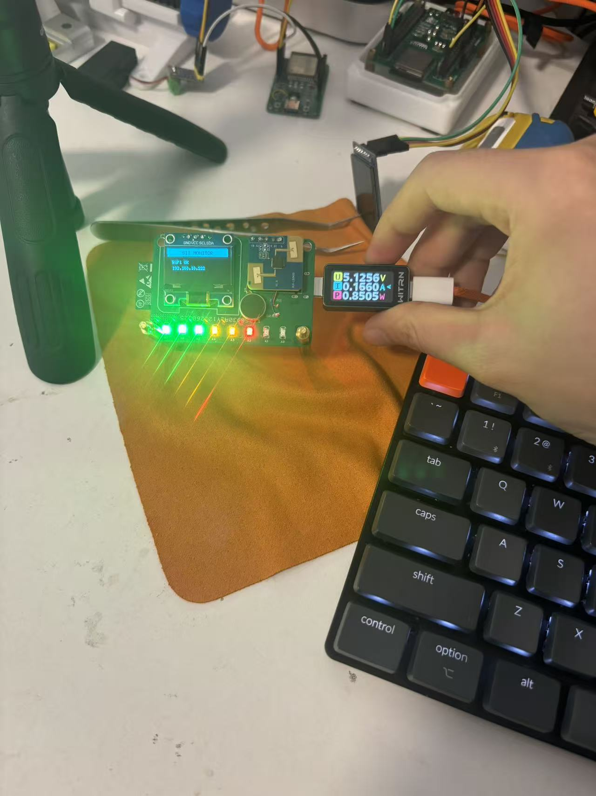
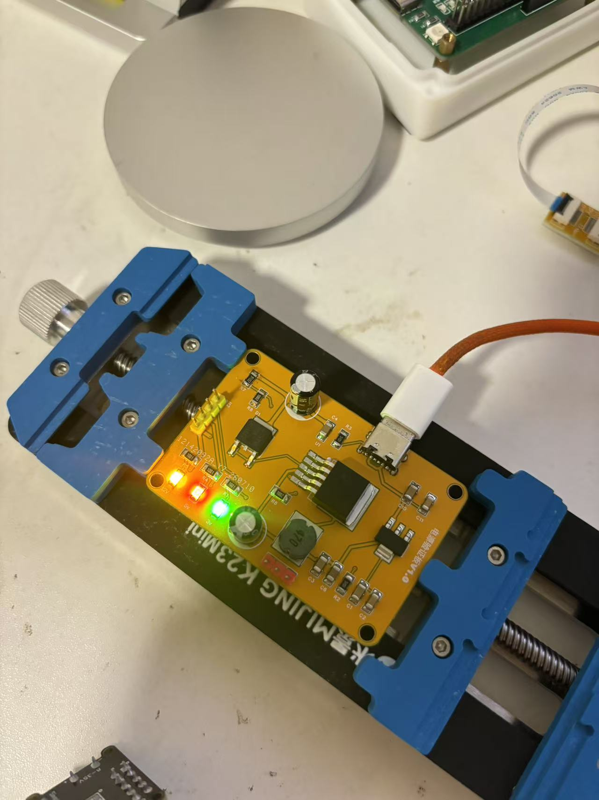
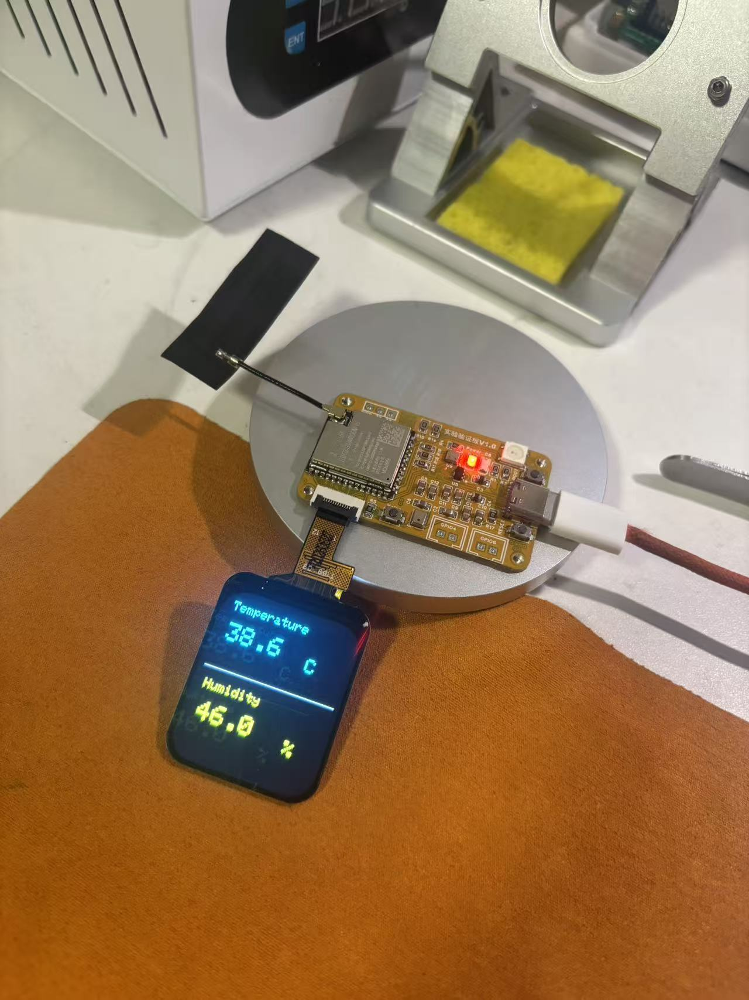
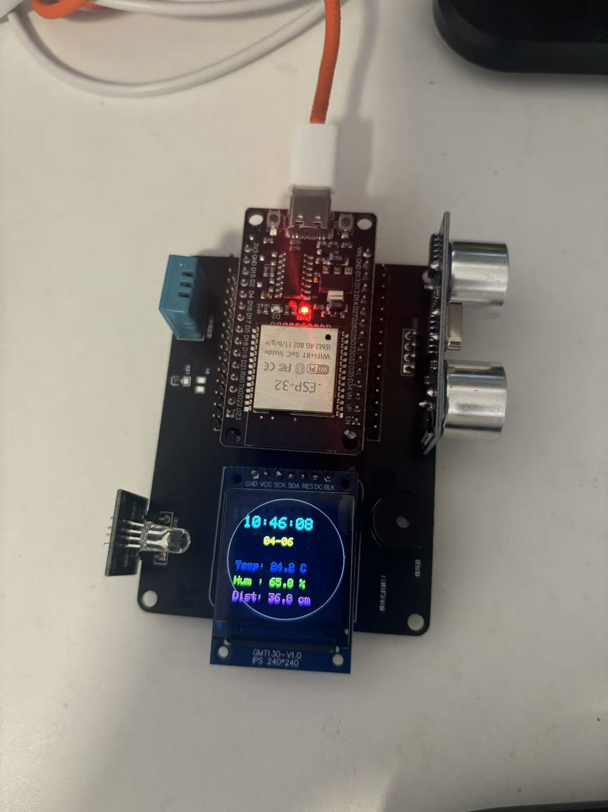
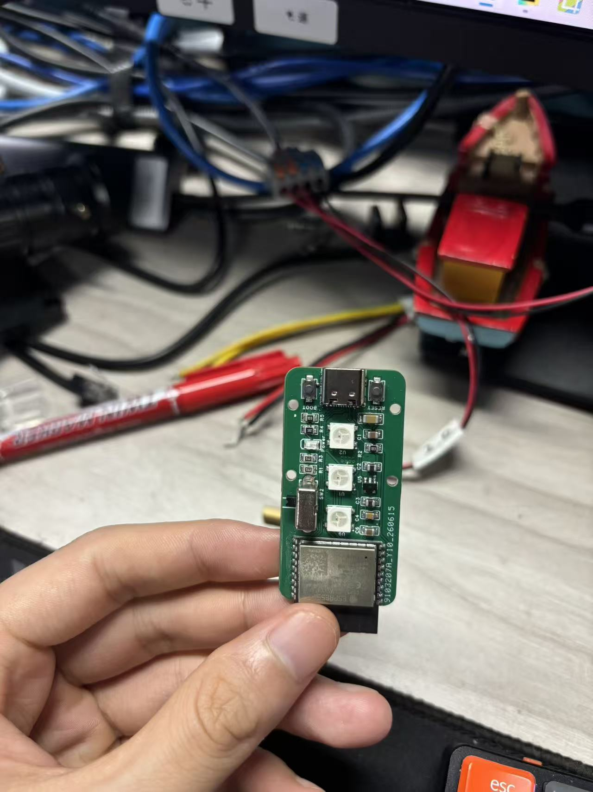

# ESP32 智能控制项目集

> 分享一些我自己做的 ESP32 小项目，免费分享给大家 😊

---

## 📢 关于这个仓库

我是 **大喇叭**，一个电子 DIY 爱好者。这些项目都是我亲手设计、焊接、调试的 ESP32 智能硬件作品，从原理图到 PCB 到实物，全部开源免费分享。

**如果你是新手小白也别怕**，每个项目都配有：
- ✅ 原理图（看得懂的电路图）
- ✅ PCB 文件（打板用的）
- ✅ 物料清单（买哪些零件）
- ✅ 实物照片（做出来长啥样）
- ✅ 代码（烧录就能用）

---

## 📦 项目总览

### 1️⃣ 久坐监测系统

长时间坐着会提醒你站起来活动，保护你的腰和颈椎。

| 项目 | 版本说明 | 文件 |
|------|---------|------|
| 🆕 **最终版** | 完整版，推荐做这个 | [查看项目文件](久坐监测最终版/) |
| **2.0 版** | 早期版本 | [查看项目文件](久坐监测2.0/) |

**实物效果：**



**硬件资料：**
- 📄 [原理图 PDF](久坐监测最终版/原理图-物料清单/SCH_Schematic1_2026-07-11.pdf)
- 🖨️ [PCB 设计图](久坐监测最终版/原理图-物料清单/PCB_PCB1_2026-07-11.pdf)
- 📋 [物料清单 BOM](久坐监测最终版/原理图-物料清单/BOM_久坐监测板_Schematic1_2026-07-11.xlsx)

**相关链接：** [点击查看项目详细介绍](https://github.com/duasong111/SedentaryMonitoring)

---

### 2️⃣ 12V 供电模块

把 USB 或电池电压转成稳定的 12V，给其他设备供电用。

**实物效果：**



**硬件资料：**
- 📄 [原理图 PDF](12V供电/原理图及物料清单/12V供电原理图.pdf)
- 📋 [物料清单 BOM](12V供电/原理图及物料清单/物料清单.xlsx)
- 🖼️ [更多实物照片](12V供电/实物图/)

---

### 3️⃣ FPC 验证板

用来测试 FPC 柔性排线连接好不好用的测试板。

**实物效果：**



**硬件资料：**
- 📄 [原理图 PDF](FPC验证/原理图+Bom/FPC板子验证.pdf)
- 📋 [物料清单 BOM](FPC验证/原理图+Bom/BOM_Board1_Schematic1_2026-07-15.xlsx)
- 🖼️ [更多实物照片](FPC验证/实物图/)

---

### 4️⃣ 墨水屏驱动模块

电子纸屏幕驱动，不耗电也能一直显示内容，适合做小标签、名牌。

**硬件资料：**
- 💻 [示例代码](墨水屏/YMS152152/YMS152152.ino)
- 📖 [使用说明](墨水屏/YMS152152/Readme.txt)

---

### 5️⃣ 智能连接系统（综合项目）

这个项目功能最多！一个板子集成了 WiFi 控制、蓝牙、温湿度监测、超声波测距、彩屏显示等功能。

**实物效果：**



**硬件资料：**
- 📄 [原理图](最开始版本-智能连接/原理图以及物料清单/schematic_diagram.png)
- 🖨️ [PCB 设计图](最开始版本-智能连接/原理图以及物料清单/PCB_PCB1_2026-04-06.pdf)
- 📋 [物料清单 BOM](最开始版本-智能连接/原理图以及物料清单/BOM_Board1_Schematic1_2026-04-06.xlsx)
- 💻 [固件代码 v1.1](最开始版本-智能连接/代码/v1.1.c)
- 📖 [详细说明书](最开始版本-智能连接/说明书.md)
- 🖼️ [更多实物照片](最开始版本-智能连接/image/)

**相关链接：** [点击查看项目详细介绍](https://github.com/duasong111/ESP32_view)

---

### 6️⃣ Claude 智能小灯

最简单的入门项目，一个 ESP32 控制小灯，适合第一次玩 ESP32 的朋友。

**实物效果：**



**硬件资料：**
- 📄 [原理图 PDF](简单Claude小灯/原理图/SCH_Schematic1_2026-07-15.pdf)
- 📋 [物料清单 BOM](简单Claude小灯/原理图/BOM_Board1_Schematic1_2026-07-15%20(1).xlsx)

---

### 7️⃣ ESP32 C3 开发板

用 ESP32-C3 芯片做的开发板，支持 WiFi 和蓝牙 5.0，个头小、功耗低。

**实物效果：**


**硬件资料：**
- 📄 [原理图 PDF](ESP32%20C3/原理图/SCH_Schematic1_2026-07-15%20(3).pdf)
- 📋 [物料清单 BOM](ESP32%20C3/原理图/BOM_Board1_Schematic1_2026-07-15%20(4).xlsx)
- 🖼️ [更多实物照片](ESP32%20C3/实物图/)

---

### 8️⃣ ESP32 S3 远程连接板

用 ESP32-S3 芯片做的远程连接板，性能更强，支持 AI 加速，适合做物联网项目。

**实物效果：**


**硬件资料：**
- 📄 [原理图 PDF](ESP32%20S3/原理图/SCH_Schematic1_2026-07-15%20(2).pdf)
- 📋 [物料清单 BOM](ESP32%20S3/原理图/BOM_远程连接板_Schematic1_2026-07-15.xlsx)
- 🖼️ [更多实物照片](ESP32%20S3/实物图/)

**相关链接：** [点击查看项目详细介绍](https://github.com/duasong111/go)

---

## 🛠️ 小白怎么做这些项目？

### 硬件制作 5 步走

```
① 看物料清单 → ② 买零件 → ③ 打板 PCB → ④ 焊接 → ⑤ 烧录代码
```

### 烧录代码 3 步走

1. **下载 Arduino IDE**（免费的，百度搜就有）
2. **安装 ESP32 支持包**（IDE 里点几下就行）
3. **打开代码 → 选好板子 → 点上传**

> 具体每一步怎么做，网上搜"Arduino ESP32 入门"就有很多教程。

### 常见问题

| 问题 | 原因 | 怎么解决 |
|------|------|---------|
| 电脑认不到设备 | 缺驱动 | 装 CH340 或 CP2102 驱动 |
| 程序烧不进去 | 没进烧录模式 | 按住 BOOT 键，再按一下 RST 键 |
| 串口没反应 | 波特率不对 | 检查是不是设成了 115200 |
| WiFi 连不上 | 密码错了 | 检查代码里的 WiFi 名和密码 |

---

## ⚙️ 通用参数

| 参数 | 数值 |
|------|------|
| 工作电压 | 3.3V |
| 供电方式 | USB 5V 或 3.3V 直供 |
| PCB 层数 | 4 层 |
| 板材 | FR-4 玻纤板 |
| 板厚 | 1.6mm |

---

## 🔗 相关链接

| 资源 | 链接 |
|------|------|
| 久坐监测项目介绍 | [github.com/duasong111/SedentaryMonitoring](https://github.com/duasong111/SedentaryMonitoring) |
| 智能连接系统介绍 | [github.com/duasong111/ESP32_view](https://github.com/duasong111/ESP32_view) |
| ESP32 S3 项目介绍 | [github.com/duasong111/go](https://github.com/duasong111/go) |
| ESP32 官方文档 | [docs.espressif.com](https://docs.espressif.com/) |
| Arduino 官网 | [arduino.cc](https://www.arduino.cc/) |

---

## ⚠️ 小提示

- 别在潮湿环境通电
- 焊接时注意防静电
- 电源别接反了

---

## 📝 版本记录

| 版本 | 日期 | 更新内容 |
|------|------|---------|
| v2.2 | 2026-07-15 | 新增 ESP32 C3、ESP32 S3 开发板 |
| v2.1 | 2026-07-15 | 新增 FPC 验证板、智能小灯 |
| v2.0 | 2026-07-11 | 新增久坐监测系统 |
| v1.0 | 2026-04-06 | 第一个版本发布 |

---

## 📬 联系我

- 邮箱：2272168170@qq.com
- 创建者：大喇叭

---

<div align="center">

**如果这些项目对你有帮助，麻烦点个 Star ⭐ 支持一下！**

**免费分享，一起玩电子！** 🎉

</div>